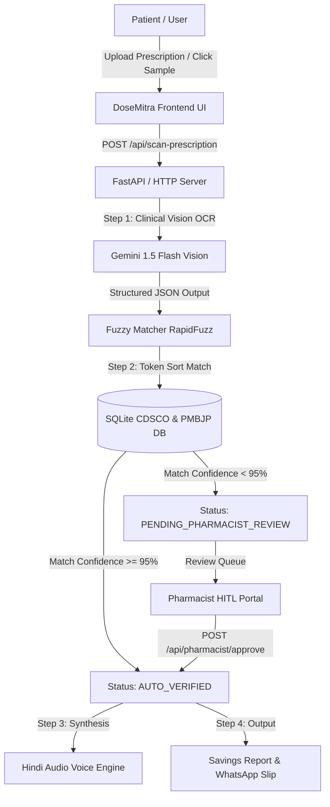

# 🩺 DoseMitra AI (डोज़मित्र)
### Smart Prescription Decoder & Jan Aushadhi Generic Medicine Recommender
**Built for Aavishkaar Young Entrepreneurs Program (YEP) 2026**  
*Lead Developer & Innovator: **Keshav Narayan** (B.Tech IT, DDU Gorakhpur)*  
*Portfolio / Platform Inspiration: [DDU B.Tech Notes](https://ddu-btech-kn-notes.vercel.app/)*

---

## 🌟 Overview
**DoseMitra AI** is an end-to-end clinical AI and healthcare equity platform engineered to solve the acute challenge of illegible handwritten doctor prescriptions and expensive branded drug monopolies in India.

By combining **Gemini 1.5 Flash Vision API**, **CDSCO Approved Active Pharmaceutical Ingredient (API) mappings**, and the **Pradhan Mantri Bhartiya Janaushadhi Pariyojana (PMBJP)** catalog, DoseMitra AI empowers patients with:
1. **Accurate Decoded Prescriptions:** Identifies medicines, dosages, and administration timings from doctor handwriting.
2. **Generic Salt Substitutions:** Maps proprietary brand names (e.g., *Augmentin 625*, *Pantocid 40*, *Glycomet GP2*) to equivalent generic chemical formulations.
3. **Up to 85% Cost Savings:** Computes instant financial comparisons against subsidized Jan Aushadhi Kendra rates.
4. **Human-In-The-Loop (HITL) Safety:** Automatically flags any confidence score below 95% to a registered pharmacist review queue (`PENDING_PHARMACIST_REVIEW`).
5. **Vernacular Hindi Audio & WhatsApp Sharing:** Speech synthesis explains dosage timings (खाली पेट या खाने के बाद) and generates one-click WhatsApp slips.

---

## 🏛️ System Architecture



---

## 🚀 Key Features

- **Gemini 1.5 Flash Vision Extraction:** Extract structured medical JSON (`patient_name`, `doctor_name`, `diagnosis`, `medicines_list: [{raw_text, dosage, timing}]`).
- **CDSCO & PMBJP Master Catalog:** 40+ pre-seeded essential Indian medicines with exact active salt chemical formulas, branded MRPs, Jan Aushadhi rates, and Hindi clinical indications.
- **Strict 95% Confidence HITL Rule:** If handwriting ambiguity causes confidence to dip below 95%, the system mandates pharmacist verification before dispensing.
- **Pharmacist Dispensing Portal:** Real-time queue for registered pharmacists to inspect high-resolution prescription images, review AI salt suggestions, and approve substitutions.
- **Hindi Voice Guidance (आवाज़ में सुनें):** In-browser speech synthesis explains how and when to consume medications in simple Hindi.
- **Direct WhatsApp Sharing:** Generates patient-ready WhatsApp prescription slips with financial savings summaries.
- **Interactive AI Chatbot:** Dedicated health assistant to answer questions about medicine storage, generic efficacy, and Jan Aushadhi centers.

---

## 📂 Project Structure

```
dosemitra_ai/
├── main.py                  # Core HTTP & API server (endpoints, routing, static serving)
├── database.py              # SQLite DB initialization & CDSCO/PMBJP catalog seed
├── gemini_vision.py         # Gemini 1.5 Flash Vision OCR integration
├── fuzzy_matcher.py         # RapidFuzz / SequenceMatcher algorithm & Hindi audio generator
├── run_demo.sh              # 1-click execution script
├── .env.example             # Environment configuration template
├── static/
│   ├── index.html           # Responsive single-page web portal (Light/Dark mode)
│   └── samples/             # Real-world clinical prescription sample images
└── uploads/                 # Storage for scanned prescription uploads
```

---

## ⚡ Quick Start Guide

### 1. Prerequisites
- Python 3.10+
- Linux / macOS / Windows WSL

### 2. Clone & Setup
```bash
git clone https://github.com/keshavnarayan501/dosemitra-ai.git
cd dosemitra-ai
```

### 3. Configure Environment
Copy `.env.example` to `.env`:
```bash
cp .env.example .env
```
*(Optional: Add your `GEMINI_API_KEY` from [Google AI Studio](https://aistudio.google.com/) for live Gemini cloud vision)*

### 4. Run Server
Execute the launcher script:
```bash
chmod +x run_demo.sh
./run_demo.sh
```
Or run directly with Python:
```bash
python3 main.py
```

### 5. Access the Web Portal
Open your browser at:
- **Web App:** [http://localhost:8080](http://localhost:8080)
- **Pharmacist HITL Queue:** [http://localhost:8080#pharmacist](http://localhost:8080#pharmacist)
- **Jan Aushadhi Master Catalog:** [http://localhost:8080#catalog](http://localhost:8080#catalog)

---

## 📊 API Reference

| Endpoint | Method | Description |
|---|---|---|
| `/api/scan-prescription` | `POST` | Accepts multipart image upload or sample path; returns decoded medicines, generic matches, and savings. |
| `/api/pharmacist/queue` | `GET` | Returns list of flagged prescriptions requiring pharmacist verification. |
| `/api/pharmacist/approve` | `POST` | Allows licensed pharmacist to verify or correct medicine substitution. |
| `/api/medicines/search` | `GET` | Live search against CDSCO approved medicines and Jan Aushadhi generic catalog. |
| `/api/chat` | `POST` | Conversational medical guidance via DoseMitra AI Assistant. |
| `/api/whatsapp-webhook` | `POST` | Webhook receiver for Twilio WhatsApp incoming prescription queries. |

---

## 👨‍💻 Developer & Attribution
- **Innovator:** Keshav Narayan
- **Institution:** Deen Dayal Upadhyaya Gorakhpur University (DDU)
- **Department:** Department of Information Technology (B.Tech)
- **Initiative:** Aavishkaar Young Entrepreneurs Program 2026

---
*Disclaimer: DoseMitra AI is designed as a decision-support system to empower patients and pharmacists. Always consult a licensed medical practitioner or registered pharmacist before taking or substituting medications.*
